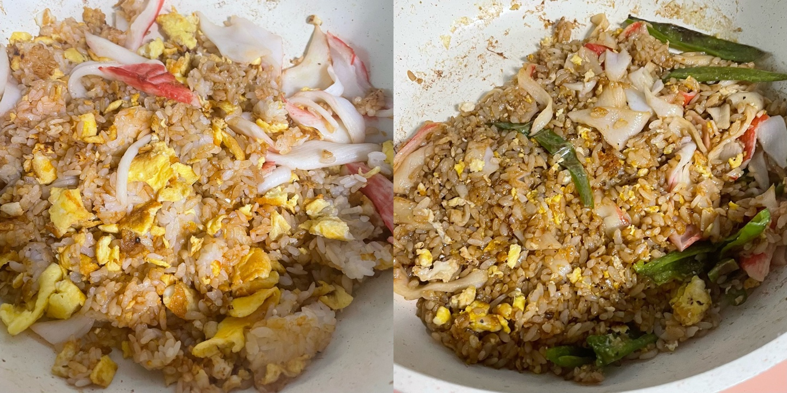
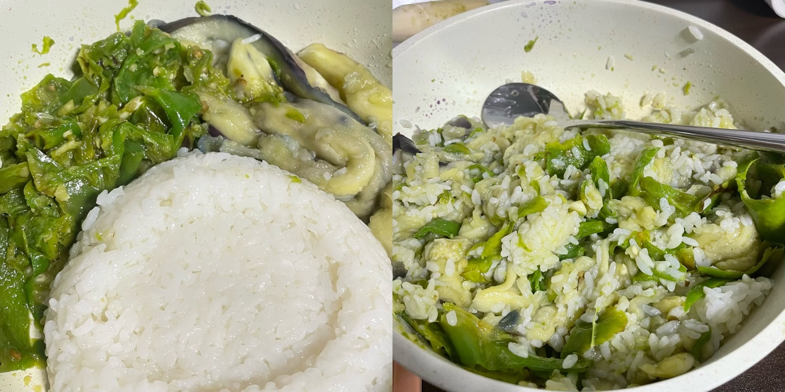

# 25W01

2024.12.30~2025.01.05

决定从2025年开始写周记，~~不知道能坚持几天先写着吧。~~

因为写2024年终总结的时候发现我因为太久不写博客导致写博客变成了一件有点沉重的事情，我平时生活里抓马搞笑的事情明明那么多……放在年单位来说是有点不值一提（其实根本想不起来），主要也是我再也不想抱有“天呐我以前/我那个时候在干嘛？？”的想法了，遂改了书摘网站写周记。

周一查了成绩，课没上几节成绩倒全是A+，教授老师们我们喜欢你……🥺

周二是2024的最后一天，也是我们课题组的组会。开完组会（三点左右）教授：为什么今天开组会我可不是坏人啊现在大家都下班吧，还定了二月初去江原道的团建，啊啊啊我要去滑雪！！

然后坐무궁화去和韩男逛了超市打算在家里煮麻辣烫跨年，结果玩화투上头直接什么也没吃地昏睡了过去。

教程是看的这个：[[고스톱 핵심] 카드구성 + 점수계산 + 게임방법 모아보기!](https://www.youtube.com/watch?v=hG_OLkdEXrs)，看得头晕脑胀第二天想再查一查bonus牌怎么用发现别人都在讲这个教程里没有的gostop，晕！

元旦和韩男date是去pc방(..)，怒打3.8小时overcooked2。吃了打算跨年吃的饭。这么拍是因为想发ins story来着但没发（为什么我也不知道

周四又坐무궁화回学校，路上右手边坐了一个外放看视频的大哥，我忍了半天对方开始打呼，又好像不是在打呼因为好像还是在看手机，难道只是呼吸声那么重？太好奇了于是往我的一点半方向看了一下，余光发现他就是呼吸声重得像打呼啊！但因为抬头这一下他突然和我搭话，问我신탄지，我内心警铃大作：？什么意思我碰到新天地传教的了？？？！！！😱😱😱好吧最后得知신탄지只是地名，新天地是신천지。

周五摸鱼到下午五点的结果是加班工到晚上九点，也不是我想摸鱼的啊！只是刚到工位的时候和chatgpt闲聊让她帮我起网名最后一不小心就额度上限了，唉希望教授能给我们买plus或者team。

好在虽然工到九点但是我的问题解决了下周发表内容🈶😎

之前用햇반做炒饭的时候总是先用微波炉叮一下再炒，这次试了直接炒竟然炒出了粒粒分明的感觉（下右）。

太想吃擂椒皮蛋了，但听前辈(?)说coupang上的皮蛋不好吃，暂时最近一时半会儿不想去中国食品店看有没有皮蛋，于是网购青椒茄子蒸锅准备做擂椒茄子。第一次擂椒大失败因为青椒太厚擂不动最后变成青椒（大块ver.）拌饭。第二次感觉擂椒很顺利啊但为什么是这个清淡的颜色，难道重点是皮蛋？总不至于是茄子皮吧？煮完茄子后由于茄子皮在滴蓝水我就剥了= =

两张图都是第二次的。

此外本周想分享的美丽照片还有：

做了兔子🫳：

写了信（包装绳是上次做圣诞树(?)剩下的）：

