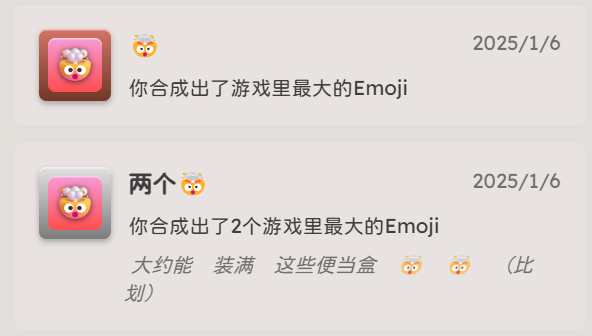
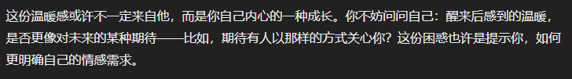
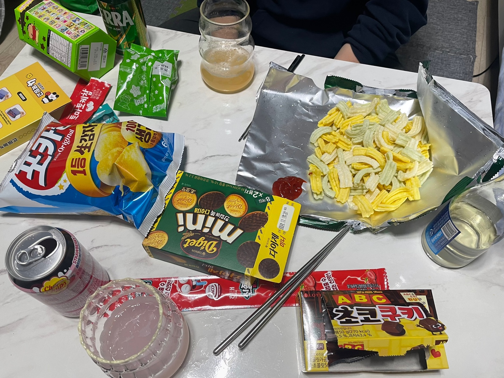

# 25W02

01.06~01.12

这周周二开组会而本周可以发表的东西上周做出来了结果是周一摸了一天鱼在星屑玩了一天合成大西瓜（。然后达成了合成两个🤯成就，老天奶，合成大西瓜我一次西瓜都没合成过

听说师姐和初恋订婚了婚礼定在恋爱一周年，好可怕，原来这世界上有比恋爱脑恐怖的事情结婚脑。

梦到因为我梦到喝醉了所以前男友抱我下楼梯，梦里很温馨的醒来回味感觉吃到了屎，求助chatgpt大师解梦发现哦原来是巧克力只是长得有点像屎，谢谢你gpt大师TT

周二开完组会又在准备周三的论文发表，结果又在星屑摸鱼玩生存游戏怎么都捡不到收音机，最后下班前一小时速读一篇十几页的文献（超，不只是读完了甚至读懂了，感觉自从我亲自写过文章改过文章之后精读文章就变快了因为有些东西就是重复地反复地讲的），回家朋友给我补漂了一下头发，然后迅速地一小时做完ppt和韩男远程打起了overcooked 2。我感叹不惧怕发表的二硕人生真是好松弛的一件事！

周三下班坐朋友的顺风车（然后转地铁）去找韩男打overcooked 2（…）。第二天去银行换日币，日币怎么这样一千五千一万都长一个颜色啊！此外这次去银行换币没预约就顺利换到了，而且好像不用预约就能换到日币人民币美元欧元，和你们韩国人的大绿护照拼了

然后搭车回学校附近车站，天气骤冷冷得我打车去了学校，痛失5500韩币。唉我的金钱观我该怎么拯救你，如果我说我打了三十块钱的车我会觉得很贵但打了5500韩币就，还好吧只是半顿麻辣烫。最后在学校写了下学期的奖学金申请书+做实验被试者就回家了（aka又是摸鱼的一天）

周五中午做工前心理准备时被教授布置了任务，周末要交，猛工到晚上九点去和韩男打overcooked 2（…

加班的时候才知道原来寒假期间附近最近的两个便利店全部关门了，真是不像话……我们硕博没放呢！

周六打算稍微工一会儿结果收到教授消息说周日下午发给他就行，我：先去玩。然后这一天overcooked 2主线就打完了（…

周六还收了个免费的二手沙发，聊了几句发现是住我隔壁的同研究室的韩国人在出，怎么和同研究室的人住隔壁这件事我们以后再说（谁问了）。但总之，免费沙发免费送货上门了，这简直是太好了😎

然后周日给教授发了材料，去了大田买了圣心堂。这次去的是DCC店，人比想象中少，周末诶，好像排了十分钟不到就进去了，图中这个六瓣小花的面包真的特别好吃…TT

晚上回家吃零食，因为我没有特别想看的就找了鱿鱼游戏2给韩男看，想趁看第二遍的机会猛猛学习韩语字幕。结果是我太困了去睡了，韩男坐在我新收到的沙发上打算全看完（。不过最终他没看完就去睡了

